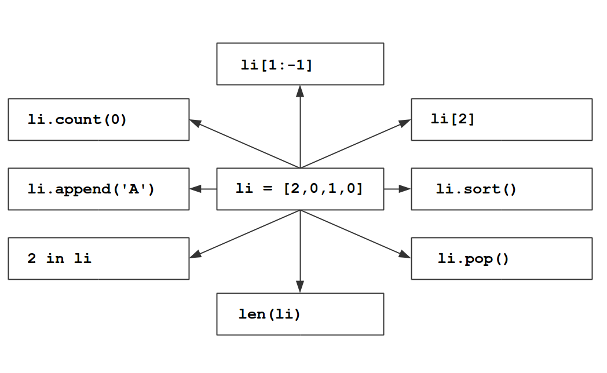

Rechnungen
==========

.. image:: receipts.jpg

Foto von `Carli Jeen auf unsplash.com <https://unsplash.com/@carlijeen?utm_content=creditCopyText&utm_medium=referral&utm_source=unsplash>`__
 

In diesem Kapitel lernst du:
----------------------------

======= ===========================================
Bereich Thema
======= ===========================================
🚀      Zahlen in einer Einkaufsliste summieren
⚙       über Listen iterieren
💡      die Methode ``list.append`` verwenden
🔀      eine Liste in eine neue transformieren
🐞      ValueErrors zu beheben
======= ===========================================

Aufgabe 1
----------

Um größere Datenmengen zu verarbeiten, können wir uns nicht für jede Zahl einen neuen Variablennamen ausdenken.
Stattdessen speichern wir mehrere Zahlen in einer **Liste**.

Das folgende Programm summiert Zahlen in einer Liste.
Vervollständige den Code, indem du ``kosten``, ``for``, ``element``, ``summe`` einsetzt.

.. code:: python

   kosten = [8, 5, 20, 12, 1]
   summe = 0
   ___ element in ___:
       ___ += ___
   print(summe)

Aufgabe 2: Methoden von Listen
------------------------------

Finde heraus was die Ausdrücke mit der Liste in der Mitte tun.

Aufgabe 3: Ein Element hinzufügen 
---------------------------------

Du möchtest ein zusätzliches Element zur Liste hinzufügen:

.. code:: python3

   kosten = [8, 5, 20, 12, 1]
   extra = 4

Verwende eine Methode aus Aufgabe 2, um das zusätzliche Element an die Liste anzuhängen.
Rechne dann die Summe aus.

Aufgabe 4: Verketten
--------------------

Erkläre den Unterchied zwischen folgenden Ausdrücken:

.. code:: python3

   [1, 2 + 3, 4]

   [1, 2] + [3, 4]

   ["1", "2" + "3", "4"]

   ["1, 2" + "3, 4"]

   "[1, 2" + "3, 4]"

Aufgabe 5: Puzzle
------------------

Verwende die Ausdrücke, um die Liste wie gezeigt zu verändern.
Verwende jeden Ausdruck genau ein Mal.

.. figure:: list_funcs2.png
   :alt: list funcs Aufgabe2

Aufgabe 6: Listen Transformieren
--------------------------------

Bisweilen ist es nützlich, eine Liste in eine neue umzuwandeln.
Dies nennt man **Transformieren** der Liste.
Sortiere die Zeilen in folgendem Programm:

.. code:: python3

   print(summe)
   kosten = ["8", "5", "20", "12", "1"]
   zahlen.append(int(item))
   for item in kosten:
   summe = sum(zahlen)
   zahlen = []

Aufgabe 7: Rechnungshelfer
--------------------------

Schreibe ein Programm, das Rechnungen zusammenzählt.
Der Benutzer gibt Zahlen ein (eine auf einmal).
Falls sie nichts eingeben (einen leeren String), rechnet das Programm den Gesamtwert der eingegebenen Beträge aus.

Die Ausgabe des Programms könnte so aussehen:

::

   Bitte gibt Beträge auf den Rechnungen ein (eine Zahl pro Zeile):
   13
   8
   5
   21

   Die Summe der Beträge ist 47

.. hint::

   Zum Eingeben der Werte benötigst du eine ``while``-Schleife.

Reflexionsfragen
----------------

-  Wie kannst du eine Liste erstellen?
-  Wie kannst du Elemente zu einer Liste hinzufügen?
-  Wie kannst du eine `for`-Schleife über eine Liste laufen lassen?
