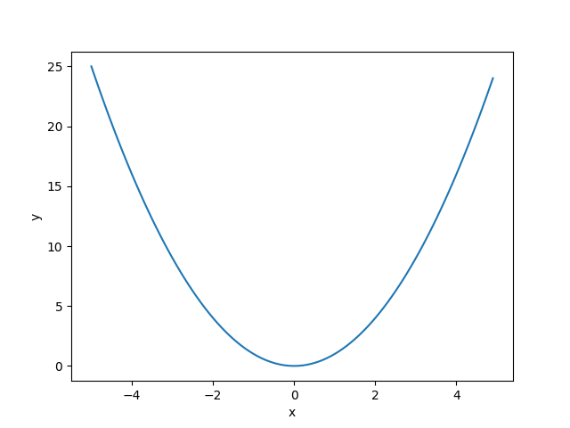

Liniendiagramme
===============

|image0|

`Bild von travelnow.or.crylater auf
Unsplash <https://unsplash.com/@travelnow_or_crylater?utm_source=unsplash&utm_medium=referral&utm_content=creditCopyText>`__

In diesem Kapitel lernst du:
----------------------------

======= =================================
Bereich Thema
======= =================================
🚀      Funktionen plotten
⚙       `for`-Schleifen verwenden
⚙       Anweisungen einrücken
💡      Die Funktion `range()` verwenden
💡      Das Modul `time` verwenden
💡      Das Modul `math` verwenden
🐞      Laufzeitfehler erkennen
======= =================================

Aufgabe 1: Motivationsübung
---------------------------

Führe das folgende Programm aus. Was passiert?

.. code:: python3

    import time

    for i in range(5):
        print("Du kannst schon super programmieren!")
        time.sleep(5)

Aufgabe 2: for-Schleife
-----------------------

Was tut das folgende Programm?

.. code:: python3
    
    for zahl in range(1, 7):
        print(zahl)

.. question::

   Warum ist die `for`-Anweisung besser als einfach sieben Mal `print()` zu schreiben?

Aufgabe 3: Einrückung
---------------------

Erkläre den Unterschied zwischen folgenden zwei Programmen:

.. code:: python3
    
    y = []
    for i in range(10):
        y.append(x * 2)
        print(y)

und

.. code:: python3
    
    y = []
    for i in range(10):
        y.append(x * 2)
        print(y)

Aufgabe 4: Quadratzahlen
------------------------

Schreibe eine Schleife mit `for`, welche folgende Liste produziert und ausgibt:

::

    [1, 4, 9 16, 25, 36, 49]

Aufgabe 5: Mathematische Funktionen
-----------------------------------

Probiere folgende Schleifen aus.
Erkläre was passiert.

.. code:: python3
    
    import math

    for x in range(10):
        print(x * 0.1)

    for x in [4, 9, 16, 25]:
        print(math.sqrt(x))

    for x in range(10):
        y = 2 ** x
        print(y)

    for x in range(0, 360, 30):
        print(math.sin(math.radians(x))

Aufgabe 6: Matplotlib
---------------------

Öffne ein Terminal. Gib folgende Zeile ein:

::

    pip install matplotlib

Dann führe folgenden Code aus:

.. code:: python3

    from matplotlib import pyplot as plt

    x = [1, 2, 3, 4, 5]
    y = [10, 20, 50, 30, 70]

    plt.plot(x, y)
   plt.xlabel("x")
   plt.ylabel("y")
   plt.savefig("diagramm.png")
    plt.show()    

Aufgabe 7: Diagramme
--------------------

Schreibe ein Programm, das eine Parabel (:math:`x^2`) im Bereich von 1 bis 10 zeichnet.

Probiere auch:

- den Bereich auf -10 bis +10 zu erweitern
- 100 Punkte zwischen 0 und 10 zu plotten
- eine Exponentialfunktion
- eine Sinusfunktion

