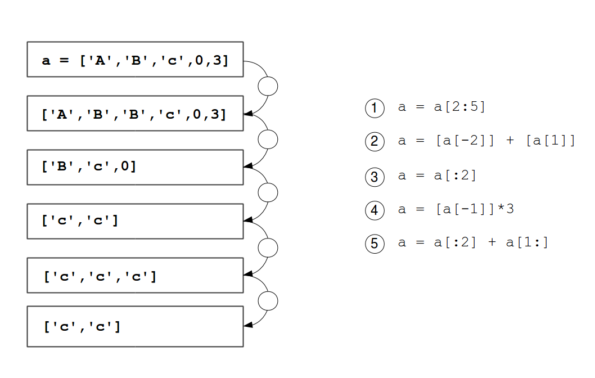

Blockchiffre
============

In diesem Kapitel lernst du:
----------------------------

======= ========================================================
Bereich Thema
======= ========================================================
🚀       eine Transpositionschiffre implementieren  
⚙        Listen und Zeichenketten per Slice aufteilen  
💡       die ``join``-Methode des ``string``-Datentyps verwenden  
🔀       eine Schleifenvariable zum Indexieren verwenden  
🔀       über Indizes eine Liste neu anordnen  
======= ========================================================

Indexieren und Slicen
---------------------

Strings und Listen sind beide geordnete Folgen von Elementen.  
Bei beiden kannst du Elemente über ihre Position ansprechen.  
Allerdings zählt Python anders als Menschen:

.. figure:: indexing.png
   :alt: Indexierung

Aufgabe 1: Listen indexieren
----------------------------

Was ergibt jeder der folgenden Ausdrücke?

.. code:: python3

   numbers = [1, 4, 9, 16, 25, 36]

   numbers[4]
   movies[0]
   movies[-1]
   numbers[-3]

Aufgabe 2: Zeichenketten slicen
-------------------------------

Was ergibt jeder der folgenden Befehle?

.. code:: python3

   name = "hello world"

   name[5:]
   name[5:10]
   name[:10:2]
   numbers[2:-2]
   numbers[::2]

Aufgabe 3: Serien
-----------------

Nutze ``list(range(start, stop, schrittweite))``, um folgende Listen zu erzeugen:

.. code:: python3

   [4, 7, 9, 12, 15]

   [10, 20, 30, 40, 50, 60]

   [33, 32, 31, 30]

Aufgabe 4: Entschlüsseln
-------------------------

Der folgende Text enthält ein verschlüsseltes Wort:

.. code:: python3

   name = "CSAIPRALKAINACZEYLVOST"

Gib jeden zweiten Buchstaben aus, beginnend mit dem zweiten.

Aufgabe 5: Slice-Rätsel
------------------------

Nutze die Ausdrücke, um die Liste wie angegeben zu verändern.  
Verwende jeden Ausdruck genau einmal.

Aufgabe 6: Blöcke
-----------------

Der folgende Code erzeugt die ersten zwei Blöcke für eine `Transpositionschiffre <https://de.wikipedia.org/wiki/Transpositionsverschl%C3%BCsselung>`__.  
Vervollständige den Code, indem du auch die restlichen zwei Blöcke erzeugst.

.. code:: python3

   nachricht = "TREFFENMORGENSVORBAHNHOF"

   block1 = nachricht[0::4]
   block2 = nachricht[1::4]
   ___
   ___
   encrypted = block1 + block2 + block3 + block4

Aufgabe 7: Transpositionschiffre
--------------------------------

Vervollständige das Programm, das einen Text mit einer Transpositionschiffre verschlüsselt:

.. code:: python3

   text = input("Gib den Text zum Verschlüsseln ein: ")
   crypto = ""
   for start in range(4):
       ___

Aufgabe 8: Entschlüsseln
------------------------

Schreibe ein Programm, das eine verschlüsselte Nachricht wieder entschlüsselt.

Aufgabe 9: Schlüssel
--------------------

Nutze einen Schlüssel wie ``2031``, der eine neue Reihenfolge der vier Blöcke vorgibt. Implementiere folgendes:

1. Erzeuge eine leere Liste  
2. Erzeuge wie zuvor die vier Blöcke und füge sie der Liste hinzu  
3. Gehe jede Stelle des Schlüssels durch  
4. Wähle aus der Liste den Block mit dem Index entsprechend der Ziffer (in int umwandeln)  
5. Füge den Block zum Ergebnisstring hinzu  

Reflexionsfragen
----------------

- Was ist Indexierung?
- Was bewirken die drei Zahlen beim *Slicing*?
- Was hältst du von der Transpositionschiffre? Ist sie sicher?
- Wie könnte man eine Transpositionschiffre ohne den Schlüssel entschlüsseln?
