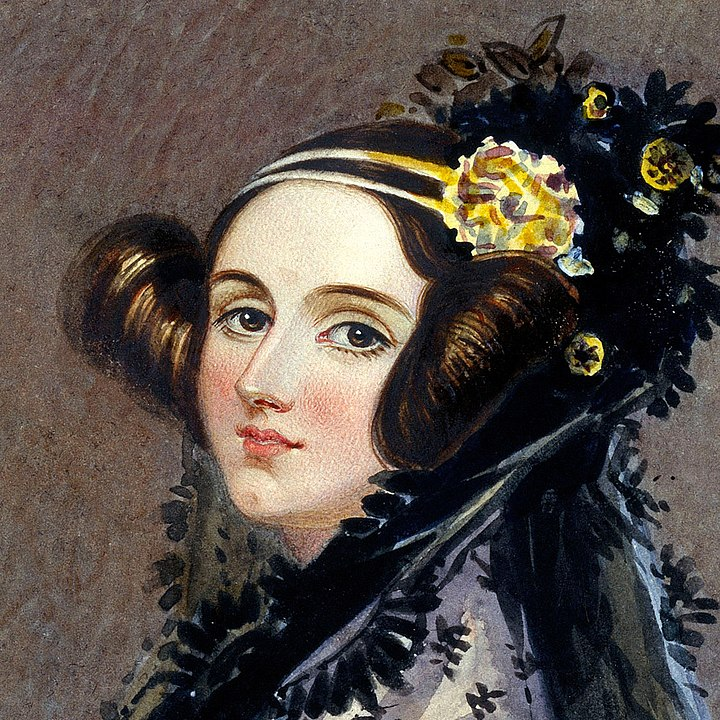

Ada Lovelace
============

`Ada Lovelace, Bild von Alfred Edward Chalon – gemeinfrei <https://commons.wikimedia.org/w/index.php?curid=25519820>`__

**Ada Lovelace** war der erste Mensch, der ein Computerprogramm geschrieben hat.
Das war eine erstaunliche Leistung – vor allem, weil Ada sich erst einmal einen Computer vorstellen musste!

In diesem Kapitel lernst du:
----------------------------

======= ===========================================
Bereich Thema
======= ===========================================
🚀       das Alter von Ada Lovelace berechnen
⚙        Datentypen unterscheiden
💡       den Datentyp `float` verwenden
💡       Datentypen ineinander umwandeln
🐞       Laufzeitfehler erkennen
======= ===========================================

Aufgabe 1: Ada Lovelace
-----------------------

Setze die folgenden Ausdrücke in die Lücken ein, so dass alle Befehle korrekt ausgeführt werden:
``alter``, ``int(alter)``, ``name``, ``str(geburtsjahr)``, ``1815``

.. code:: python3

   name = "Ada Lovelace"
   geburtsjahr = ___
   ___ = "37"
   
   text = ___ + " wurde im Jahr " + ___ + " geboren."
   jahr = geburtsjahr + ___
   print(text)
   print(jahr)

.. hint::

   Python enthält viele Funktionen zur **Typumwandlung**.
   Mit den Funktionen ``int()``, ``float()`` und ``str()`` kannst du Zahlen und Zeichenketten (Strings) ineinander umwandeln.

Aufgabe 2: Neun plus neun
-------------------------

Füge ``int()`` oder ``str()`` in die Anweisungen ein, sodass sie fehlerfrei ausgeführt werden können.

.. code:: python3

   9 + 9
   9 + "9"
   "9" + "9"
   9 * "9"

Aufgabe 3: Ausgabe
------------------

Welche der folgenden `print`-Anweisungen funktionieren?

.. code:: python3

   print("9" + "9")
   print "neun"
   print(str(9) + "neun")
   print(9 + 9)
   print(9 + int("9"))
   print(neun)
   print(float("9") + int(9.0))

Aufgabe 4: Debugging
--------------------

Der folgende Code soll das Alter von Ada in einem vom Benutzer eingegebenen Jahr berechnen.
Er enthält **drei Fehler**. Finde und korrigiere sie.

.. code:: python3

   geburtsjahr = 1815
   jahr = input('Welches Jahr schreiben wir? ')
   alter = geburtsjahr - jahr
   
   print("Heute wäre Ada Lovelace " + alter + " Jahre alt.")

Aufgabe 5: Altersrechner
------------------------

Schreibe ein Programm, bei dem du das Jahr deiner Geburt eingeben kannst.
Das Programm soll dann dein Alter zum 1. Januar dieses Jahres berechnen.

Du kannst folgenden Code verwenden, um das aktuelle Jahr zu berechnen:

.. code:: python3

   import time
   
   jahr = time.time() // (365 * 24 * 60 * 60) + 1970

.. hint::

   ``time`` ist ein Python-Modul. Es enthält viele    nützliche Funktionen.
   
   ``time.time()`` ist eine Funktion in diesem Modul.
   Sie gibt die Anzahl der Sekunden zurück, die seit dem 1. Januar 1970 vergangen sind
   (dieses Datum wird auch *„Unix-Epoche“* genannt – so  etwas wie das Jahr 0 für Computer).

Reflexionsfragen
----------------

* Welche Datentypen hast du bisher kennengelernt?
* Was macht eine Typumwandlungsfunktion?
* Was ist ein ``TypeError``?
